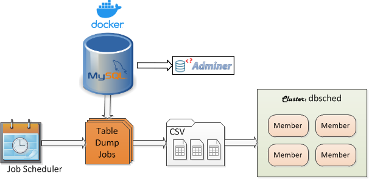

 [*PadoGrid*](https://github.com/padogrid) | [*Catalogs*](https://github.com/padogrid/catalog-bundles/blob/master/all-catalog.md) | [*Manual*](https://github.com/padogrid/padogrid/wiki) | [*FAQ*](https://github.com/padogrid/padogrid/wiki/faq) | [*Releases*](https://github.com/padogrid/padogrid/releases) | [*Templates*](https://github.com/padogrid/padogrid/wiki/Using-Bundle-Templates) | [*Pods*](https://github.com/padogrid/padogrid/wiki/Understanding-Padogrid-Pods) | [*Kubernetes*](https://github.com/padogrid/padogrid/wiki/Kubernetes) | [*Docker*](https://github.com/padogrid/padogrid/wiki/Docker) | [*Apps*](https://github.com/padogrid/padogrid/wiki/Apps) | [*Quick Start*](https://github.com/padogrid/padogrid/wiki/Quick-Start)

---

<!-- Platforms -->
[](https://github.com/padogrid/padogrid/wiki/Platform-PadoGrid-1.x) [](https://github.com/padogrid/padogrid/wiki/Platform-Host-OS) [](https://github.com/padogrid/padogrid/wiki/Platform-VM) [](https://github.com/padogrid/padogrid/wiki/Platform-Docker) [](https://github.com/padogrid/padogrid/wiki/Platform-Kubernetes)

# Bundle: dbsched

The `dbsched` bundle is preconfigured with the Pado scheduler to periodically execute jobs that dump database tables to CSV files from which it automatically extracts column information to generate the corresponding `VersionedPortable` classes. It then transforms the CSV records to objects using the generated classes before ingesting them into Hazelcast.

## Installing Bundle

```console
install_bundle -download  bundle-hazelcast-3n4n5-app-pado_dbsched-perf_test_dbsched-docker-mysql
```

## Use Case

In this use case, to control the system load, the IT department has put restrictions on applications from accessing the database in real time, especially during the business hours. Only select applications are allowed to read the database in a batch mode. Writes are not permitted. Our task is to download the data from the database and feed it to Hazelcast as follows:

1. Dump table contents to CSV files
2. Create `VersionedPortable` classes based on CSV file contents
3. Transform CSV records to objects
4. Ingest the transformed data into Hazelcast
5. Automate and schedule jobs to periodically repeat the above steps



## Bundle Contents

```console
apps
├── pado_dbsched
└── perf_test_dbsched

docker
└── mysql
```

## Hazelcast Cluster

Let's create a new Hazelcast cluster. Make sure to name the cluster `dbsched`. The scheduler has been preconfigured with the `dbsched` cluster. See Step 3 in [Configuring and Running Pado Scheduler](#configuring-and-running-pado-scheduler).

```bash
# Create dbsched
create_cluster -product hazelcast -cluster dbsched

# Switch to the dbsched cluster so that we are in the Hazelcast cluster context
switch_cluster dbsched
```

## Job Scheduler and ETL

This bundle includes the Pado scheduler to simplify the ETL process. The Pado scheduler offers the following:

1. Schedule jobs that execute SQL queries and dump the results to CSV files.
2. Automatically generate Hazelcast `VersionedPortable` classes based on CSV file contents.
3. Automatically generate schema (metadata) files for ingesting `VersionedPortable` objects into Hazelcast maps.
4. Transform CSV file contents to `VersionedPortable` objects.
5. Ingest `VersionedPortable` objects into Hazelcast.

We could also use the popular schedulers like Spring Cloud Data Flow and Apache Nifi but we would need to manually perform data transformation.

## Database: `nw` Schema

Open MySQL Workbench and create the `nw` schema. When you run the test_group script (see below), the `customers` and `orders` tables will automatically be created by Hibernate.

### MySQL Docker Container

If you prefer to use Docker to start MySQL, start the MySQL container as follows.

```bash
cd_docker mysql
docker compose up -d
```

MySQL root account is setup as follows:

| Parameter      | Value                 |
| -------------- | --------------------- |
| Adminer URL    | http://localhost:8080 |
| MySQL User     | root                  |
| MySQL Password | rootpw                |
| MySQL Port     | 3306                  |

Create the `nw` database using Adminer.

- Login to MySQL from Adminer URL 
- Select **SQL command** from Adminer
- Execute the following:

```sql
create database nw; 
```

## Building `perf_test_dbsched`

We need to download the MySQL binary files by building `perf_test_dbsched` as follows.

```console
cd_app perf_test_dbsched/bin_sh
./build_app
```

## Configuring Hibernate

The `perf_test_dbsched` app has been preconfigured to connect to MySQL on localhost with the user name `root` and the password `rootpw`. You can change the user name and password in `etc/hibernate.cfg-mysql.xml`.
We will be using the `perf_test` app to load data directly into the database tables. After the database has been loaded with data, we will execute the use case by first dumping database tables to CSV files.

```console
# Change database user name and password in the Hibernate config file.
cd_app perf_test_dbsched
vi etc/hibernate.cfg-mysql.xml
```

## Loading Data into Database

Let's load mock data into the `nw.customers` and `nw.oders` tables by executing the `test_group -db` command. The `-db` option directly loads data into the database instead of Hazelcast.

```console
cd_app perf_test_dbsched/bin_sh
./test_group -db -run -prop ../etc/group-factory.properties
```

## Building Pado App

```console
cd_app pado_dbsched/bin_sh
./build_app
```

## Configuring and Running Pado Scheduler

1. Encrypt the database password. Copy the encrypted password.

```console
cd_app pado_dbsched
cd pado_<version>/bin_sh/tools
./encryptor
```

2. Copy the included scheduler job to the scheduler's data directory.

```console
cd_app pado_dbsched
cp -r scheduler pado_<version>/data/
```

3. Edit the job file and enter the user name and encrypted password.

```console
cd pado_<version>/data/scehduler/etc
vi mysql.json
```

The `mysql.json` file contents are shown below. It configures the Pado scheduler to import the `nw.customers` table once a day at midnight and the `nw.orders` table every hour.

Note that the `GridId` attribute must be set to the Hazelcast cluster name. In our case, it is set to `dbsched`. 

```json
{
        "Driver": "com.mysql.cj.jdbc.Driver",
        "Url": "jdbc:mysql://localhost:3306/nw?allowPublicKeyRetrieval=true&serverTimezone=America/New_York",
        "User": "root",
        "Password": "",
        "Delimiter": ",",
        "Null": "'\\N'",
        "GridId": "dbsched",
        "Paths": [
                {
                        "Path": "nw/customers",
                        "Columns": "customerId, address, city, companyName, contactName, contactTitle, country, fax, phone, postalCode, region",
                        "Query": "select * from nw.customers",
                        "Day": "Sunday, Monday, Tuesday, Wednesday, Thursday, Friday, Saturday",                                "Time": "00:00:00"
                },
                {
                        "Path": "nw/orders",
                        "Columns": "orderId, customerId, employeeId, freight, orderDate, requiredDate, shipAddress, shipCity, shipCountry, shipName, shipPostalCode, shipRegion, shipVia, shippedDate",
                        "Query": "select * from nw.orders",
                        "Day": "Sunday, Monday, Tuesday, Wednesday, Thursday, Friday, Saturday",                                "Time": "00:00:00, 01:00:00, 02:00:00, 03:00:00, 04:00:00, 05:00:00, 06:00:00, 07:00:00, 08:00:00, 09:00:00, 10:00:00, 11:00:00, 12:00:00, 13:00:00, 14:00:00, 15:00:00, 16:00:00, 17:00:00, 18:00:00, 19:00:00, 20:00:00, 21:00:00, 22:00:00, 23:00:00"
                }
        ]
}
```

❗️ Note that `serverTimezone` is set to `America/New_York` for the JDBC URL. Without it, you may see the following exception if your MySQL uses the system timezone and unable to calculate the dates due to the leap year.

```console
com.mysql.cj.exceptions.WrongArgumentException: HOUR_OF_DAY: 2 -> 3
```

4. We need to first execute the `mysql.json` job without scheduling it to generate the schema files. Run the following command to download data into CSV files in the default `data/scheduler/import` directory.

```console
cd_app pado_dbsched
cd pado_<version>/bin_sh/hazelcast
./import_scheduler -now
```

5. Generate schema files using the downloaded data files.

```console
./generate_schema -schemaDir data/scheduler/schema -dataDir data/scheduler/import -package org.hazelcast.data.demo.nw
```

6. Generate the corresponding `VersionedPortable` source code in the default `src/generated` directory.

```console
./generate_versioned_portable -schemaDir data/scheduler/schema -fid 20000 -cid 20000
```

7. Add the generated factory class information in the cluster's configuration file.

```bash
switch_cluster dbsched
vi etc/hazelcast.xml
```

Add the following towards the bottom of the `etc/hazelcast.xml` file:

```xml
   <serialization>
   ...
      <portable-factory factory-id="20000">
       org.hazelcast.data.demo.nw.PortableFactoryImpl
      </portable-factory>
   </serialization>
```

8. Compile the generated code and deploy the generated jar file to the workspace `plugins` directory so that it will be included in the cluster class path.

```console
cd_app pado_dbsched
cd pado_<version>/bin_sh/hazelcast
./compile_generated_code
cp ../../dropins/generated.jar $PADOGRID_WORKSPACE/plugins/
```

9. Start Hazelcast cluster.

```console
# Stat cluster
start_cluster
```

10. Import the downloaded data into the cluster.

```console
cd_app pado_dbsched
cd pado_<version>/bin_sh/hazelcast
./import_scheduler -import
```

11. Execute the `read_cache` command to verify the data in the Hazelcast cluster.

```bash
cd_app perf_test_dbsched
./read_cache nw/customers
./read_cache nw/orders
```

12. Execute the following SQL statements in your database to verify the data.

```sql
select * from nw.customers;
select * from nw.orders;
```

13. Once you are satisfied with the results, you can schedule the job by executing the following.

```console
cd_app pado_dbsched
cd pado_<version>/bin_sh/hazelcast
./import_scheduler -sched
```

Output:

```console
./import_scheduler started. Please see the following log files for status:
   /Users/dpark/Padogrid/workspaces/rwe-bundles/bundle-hazelcast-3n4n5-app-pado_dbsched-perf_test_dbsched-docker-mysql/apps/pado_dbsched/pado_0.5.0-B1-SNAPSHOT/log/./import_scheduler.log
```

14. Check the scheduler's log file to verify the scheduled jobs.

```bash
 cat  /Users/dpark/Padogrid/workspaces/rwe-bundles/bundle-hazelcast-3n4n5-app-pado_dbsched-perf_test_dbsched-docker-mysql/apps/pado_dbsched/pado_0.5.0-B1-SNAPSHOT/log/./import_scheduler.log
```

Output:

```console
[info 2024/03/19 11:41:12.809 EDT <main main> tid=1] ImportScheduler started. All import results are logged in this file.
isSched=true
isNow=false
isImport=false
[config 2024/03/19 11:41:13.079 EDT <main main> tid=1] com.netcrest.pado.tools.db.DbManager.logScheduledList(DbManager.java:394): DB import tasks scheduled:
1. SUNDAY 00:00:00 dbsched//nw/customers [select * from nw.customers]
2. SUNDAY 00:00:00 dbsched//nw/orders [select * from nw.orders]
3. SUNDAY 01:00:00 dbsched//nw/orders [select * from nw.orders]
4. SUNDAY 02:00:00 dbsched//nw/orders [select * from nw.orders]
...
174. SATURDAY 22:00:00 dbsched//nw/orders [select * from nw.orders]
175. SATURDAY 23:00:00 dbsched//nw/orders [select * from nw.orders]
```

As you can see from the above log output, the `nw.customers` table is scheduled to be imported to the `nw/customers` map every Sunday at 00:00:00. The `nw.orders` table, on the other hand, is secheduled to be imported to the `nw/orders` map every hour.

15. Try updating the database to see if the updates get imported into Hazelcast. Keep in mind that you will need to wait up to an hour before the updates make to Hazelcast.

## Tearing Down

```console
# Stop the Hazelcast cluster
stop_cluster

# Run jps to find and kill the 'HazelcastImportScheduler' process
jps |grep HazelcastImportScheduler | kill -9 $(awk '{print $1}')
```

---

 [*PadoGrid*](https://github.com/padogrid) | [*Catalogs*](https://github.com/padogrid/catalog-bundles/blob/master/all-catalog.md) | [*Manual*](https://github.com/padogrid/padogrid/wiki) | [*FAQ*](https://github.com/padogrid/padogrid/wiki/faq) | [*Releases*](https://github.com/padogrid/padogrid/releases) | [*Templates*](https://github.com/padogrid/padogrid/wiki/Using-Bundle-Templates) | [*Pods*](https://github.com/padogrid/padogrid/wiki/Understanding-Padogrid-Pods) | [*Kubernetes*](https://github.com/padogrid/padogrid/wiki/Kubernetes) | [*Docker*](https://github.com/padogrid/padogrid/wiki/Docker) | [*Apps*](https://github.com/padogrid/padogrid/wiki/Apps) | [*Quick Start*](https://github.com/padogrid/padogrid/wiki/Quick-Start)
